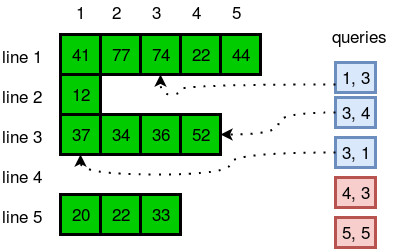

## [Java Arraylist](https://www.hackerrank.com/challenges/java-arraylist)

Sometimes it's better to use dynamic size arrays. 
Java's [Arraylist](https://docs.oracle.com/javase/7/docs/api/java/util/ArrayList.html) can provide you this feature.
Try to solve this problem using Arraylist.

You are given `n` lines. In each line there are zero or more integers. 
You need to answer a few queries where you need to tell the number located in `yth` position of `xth` line.

Take your input from System.in.

**Input Format**

The first line has an integer `n`. 
In each of the next `n` lines there will be an integer `d` denoting number of integers on that line and then there will be `d` space-separated integers. In the next line there will be an integer `q` denoting number of queries. 
Each query will consist of two integers `x` and `y`.

**Constraints**
* 1 <= n <= 20000
* 0 <= d <= 50000
* 1 <= q <= 1000
* 1 <= x <= n

Each number will fit in signed integer.
Total number of integers in `n` lines will not cross 100000.

**Output Format**
In each line, output the number located in `yth` position of `xth` line. 
If there is no such position, just print `"ERROR!"`

**Example**
````
Sample Input
5
5 41 77 74 22 44
1 12
4 37 34 36 52
0
3 20 22 33
5
1 3
3 4
3 1
4 3
5 5

Sample Output
74
52
37
ERROR!
ERROR!
````
Explanation

The diagram below explains the queries:
