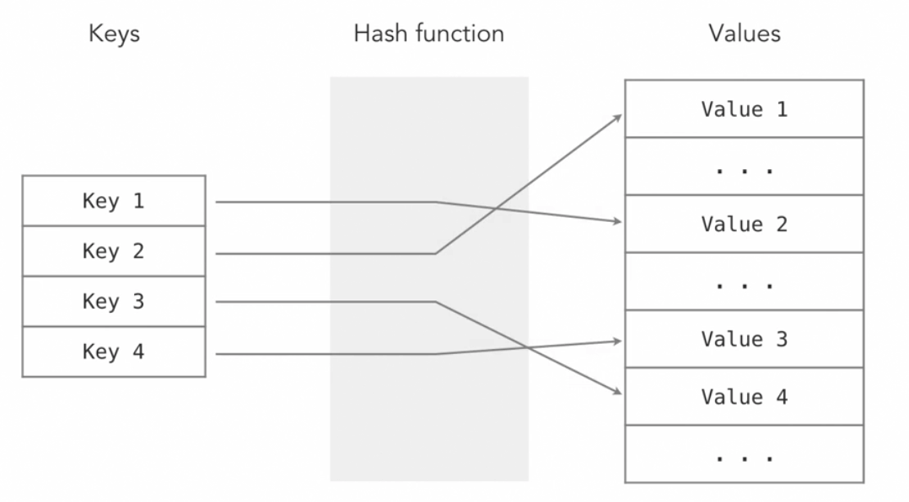

Hash Tables

* an associative array
* a data structure that is used to store keys/value pairs
* uses a hash function to compute an index into the slots that are in the hash table and map the key to the value

Partical Examples 
* phone number lookups - the name would be the key and the number would be the value

