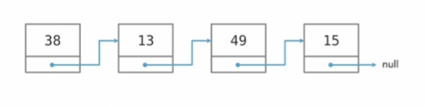

Linked Lists

* Collection of data elements, called nodes
* Contain references to the next node in the list
* Hold whatever data the application needs
*  Linked lists provide a benefit over regular arrays in that it's fast and easy to add and remove items from the list.

* The first item in the list is called the head. 
* Each element has a field that refers to the next item in the list. 
* The last item in the list has a field that points to nothing.
* In this particular case, this a singly-linked list.

