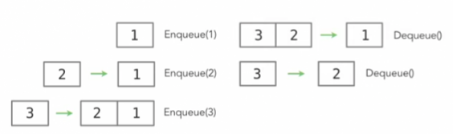

Queues 

* A collection that supports adding and removing 
* First item added is first item out 

Partical Applications 

* Order processing - ensures that orders for a product are fulfilled in the order in that they were received by the system. 
* Messaging - When you're using your phone's SMS messenger app and entering each message, you want to make sure that each of those messages is sent in the order they were written. 