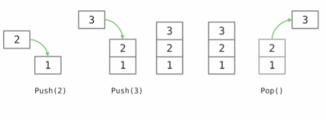

Stacks 

* A collection that supports push and pop operations
* Stacks are last-in, first-out data structures

Partical Applications:

* Expression processing - are often used to parse and evaluate various forms of expression statements. An example of this would be using a stack to evaluate a mathematical expression that is written using reverse Polish notation.
* Backtracking: using the back button in your broswer 