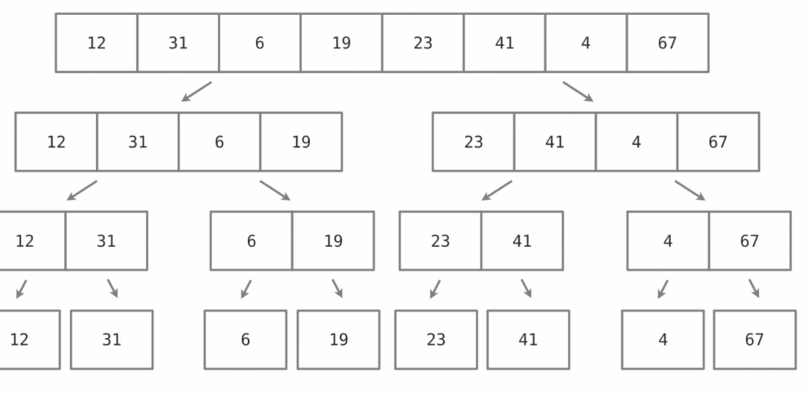

Merge Sort

* divide-and-conquer algorithm
* Breaks a dataset into individual pieces and merges them together
* Uses recursion to operate on datasets
* Time Complexity: generally, O(n log n)

* Returns a single merged array that remains sorted